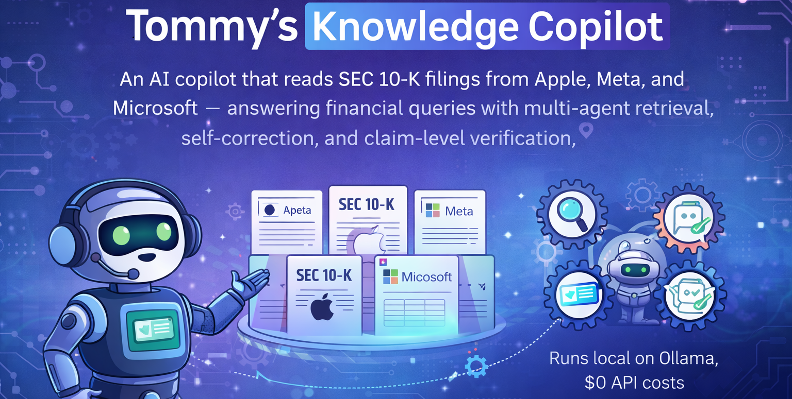
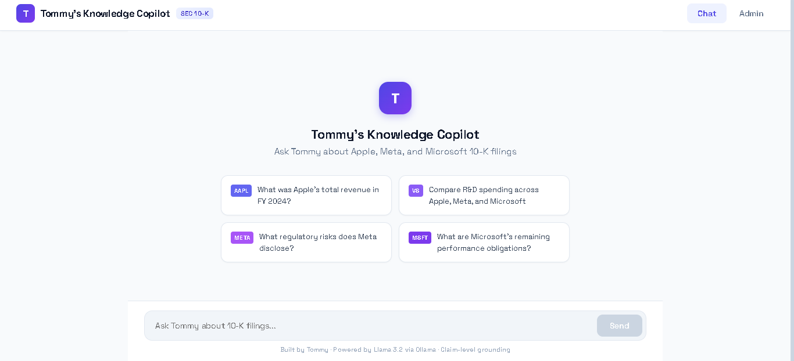
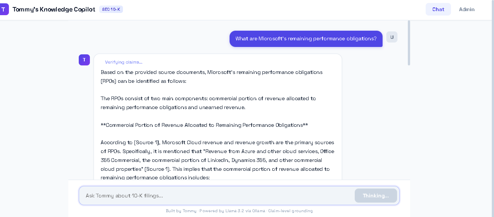
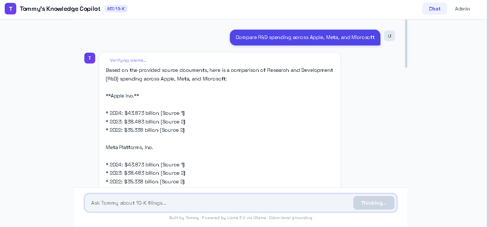
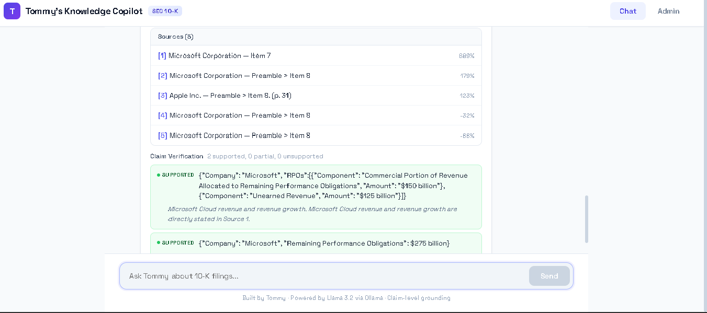
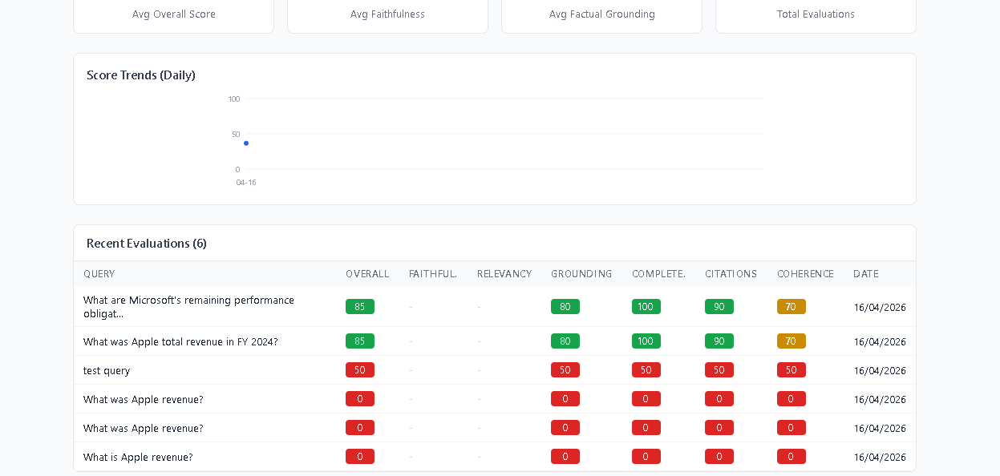

# Tommy's Knowledge Copilot

**An AI copilot that reads SEC 10-K filings from Apple, Meta, and Microsoft, answering financial queries with multi-agent retrieval, self-correction, and claim-level verification. A comprehensive evaluation pipeline ensures answer quality is measured, not assumed. Runs fully local on Ollama with zero API costs.**

---

## The Problem

Financial analysts, investors, and compliance teams spend hours cross-referencing SEC filings, hunting through hundreds of pages of 10-K reports for revenue figures, risk factors, segment breakdowns, and footnote disclosures. Existing tools return documents, not answers. When answers *are* generated, there is no way to verify them; in finance, a hallucinated revenue figure is worse than no answer at all.

### What This Project Does

1. **Reads across 10-K filings from multiple companies**, PDF and SEC XBRL/HTML formats
2. **Reasons through multi-step retrieval** via a four-agent LangGraph pipeline
3. **Self-corrects hallucinations before responding**, claim-level grounding against source chunks
4. **Surfaces confidence scores, source citations, and per-claim verification**, full transparency
5. **Evaluates itself on every response**; LLM-as-judge scoring, RAGAs-style metrics, golden dataset regression testing, and a feedback loop for continuous improvement

### Business Impact

| Metric | Before | After |
|--------|--------|-------|
| Time to answer financial queries | Hours of manual cross-referencing | Under 10 seconds |
| Cross-company comparison | Manual side-by-side reading | Instant comparative answers |
| Answer reliability | Trust the analyst's reading | Self-correction + claim-level verification |
| Quality measurement | "Seems right" | Quantified: faithfulness, grounding, completeness scores |
| Operational cost | N/A | $0 per query, fully local inference via Ollama |

---


### Chat Landing Page

The landing page displays pre-built sample queries spanning single-company factual, cross-company comparison, regulatory risk, and detail lookup categories, each tagged with the relevant company ticker.



### Streaming Chat with Inline Citations

Responses stream in real-time via SSE. The "Verifying claims..." indicator shows the Critic agent is actively decomposing the answer into atomic claims and checking each one against retrieved source chunks before finalizing.



### Cross-Company Comparison (Multi-Agent Routing)

When the Planner detects multiple companies in the query, it decomposes into per-company sub-queries, retrieves context scoped to each company's filing, and synthesizes a comparative answer with per-figure [Source N] citations.



### Claim Verification & Source Attribution

After generation, the Critic agent decomposes the answer into atomic claims and verifies each one. The panel shows ranked sources with relevance scores (889%, 179%, etc., relative to the query) alongside per-claim grounding status: **Supported**, **Partially Supported**, or **Unsupported**.



### Evaluation Dashboard

Every chat response is automatically scored by the LLM-as-Judge across four dimensions (factual grounding, completeness, citation quality, coherence) plus RAGAs-style metrics (faithfulness, answer relevancy). Scores are stored in PostgreSQL and visualized with daily trend lines.



### Admin Dashboard

The admin view provides system stats, document management (upload, re-index), ingestion pipeline status, and the full evaluation score table. Scores are color-coded: green (80%+), yellow (60-79%), red (<60%).


---

## Architecture

### System Overview

```
                                    +--------------------+
                                    |   React Frontend   |
                                    |   (Chat + Admin)   |
                                    +--------+-----------+
                                             |
                                    +--------v-----------+
                                    |    FastAPI Backend  |
                                    |  /chat /search /eval|
                                    +--------+-----------+
                                             |
                    +------------------------+------------------------+
                    |                        |                        |
           +--------v--------+    +----------v----------+   +---------v---------+
           |  LangGraph       |    |  Hybrid Search      |   |  Evaluation       |
           |  Agent Pipeline  |    |  Dense + BM25       |   |  Pipeline         |
           |                  |    |  + Cross-Encoder    |   |                   |
           |  Planner         |    |  Re-ranking         |   |  RAGAs Metrics    |
           |  Retriever       |    +----------+----------+   |  LLM Judge        |
           |  Generator       |               |              |  Golden Dataset   |
           |  Critic          |    +----------v----------+   |  Feedback Loop    |
           +---------+--------+    |                     |   +---------+---------+
                     |             |  Qdrant    Postgres  |             |
                     |             |  (vectors) (metadata)|             |
                     |             +---------------------+             |
                     |                                                 |
                     +---> Ollama (Llama 3.2 1B + nomic-embed-text) <--+
                                  Fully Local · Zero API Cost
```

### Multi-Agent Self-Correction Loop

The pipeline uses four specialized agents orchestrated as a LangGraph `StateGraph` with conditional routing:

```
User Query
  |
  v
+-----------+     +-----------+     +-----------+     +-----------+
|  Planner  | --> | Retriever | --> | Generator | --> |  Critic   |
|           |     |           |     |           |     |           |
| Decompose |     | Hybrid    |     | Streaming |     | Decompose |
| query into|     | search per|     | answer    |     | into      |
| sub-queries|    | sub-query |     | with      |     | atomic    |
| + routing |     | + re-rank |     | citations |     | claims    |
+-----------+     +-----------+     +-----------+     +-----+-----+
      ^                                                     |
      |                                              Confidence >= 0.65?
      |                                               /            \
      |                                             YES             NO
      |                                              |               |
      |                                        +-----v-----+   +----v--------+
      |                                        |  Finalize  |   | Reformulate |
      |                                        |  + Judge   |   | & Retry     |
      |                                        +-----------+   | (max 2x)    |
      |                                                        +------+------+
      |                                                               |
      +---------------------------------------------------------------+
```

| Agent | Role | Key Decision |
|-------|------|-------------|
| **Planner** | Decomposes queries, detects companies, selects retrieval strategy | Single vs. cross-company vs. comparison routing |
| **Retriever** | Runs hybrid search per sub-query, merges and re-ranks contexts | Company-scoped search, top-k selection |
| **Generator** | Synthesizes streaming response with inline `[Source N]` citations | Token-by-token SSE delivery |
| **Critic** | Decomposes answer into atomic claims, verifies each against sources | Confidence scoring, unsupported claim flagging |

When confidence drops below 0.65, the **conditional router** triggers the Planner to reformulate the query and retry (max 2 retries), ensuring the system self-corrects before presenting low-quality answers.

### Data Flow: Ingestion to Answer

```
Raw 10-K Filings (PDF, HTM/XBRL)
  |
  v  [Parsers: PyMuPDF, BeautifulSoup + XBRL tag stripping]
Parsed Sections (text + tables + headings)
  |
  v  [Structure-Aware Chunker: table preserver, heading detector, boundary detector]
Chunks (~1000 chars each, tables kept intact)
  |
  v  [Enrichment: TF-IDF keywords, Llama 3.2 summaries, metadata]
Enriched Chunks
  |
  +----> PostgreSQL (text, metadata, keywords, section path, provenance)
  |
  +----> Qdrant (nomic-embed-text embeddings, 768-dim vectors)
  |
  v  [At query time]
Hybrid Search (60% dense + 40% BM25, fused via Reciprocal Rank Fusion)
  |
  v  [Cross-Encoder Re-ranking: ms-marco-MiniLM-L-6-v2]
Top-k Relevant Chunks
  |
  v  [Multi-Agent Pipeline: Plan -> Retrieve -> Generate -> Critique]
Verified Answer with Citations, Confidence, Claim Grounding
  |
  v  [Background: LLM Judge + RAGAs metrics -> PostgreSQL]
Scored & Stored for Quality Tracking
```

---

## Dataset

Three real SEC 10-K annual filings:

| File | Company | Format | Size | Fiscal Year |
|------|---------|--------|------|-------------|
| `apple-10k-2024.pdf` | Apple Inc. | PDF (121 pages) | 964 KB | FY 2024 |
| `meta-10k-2024.htm` | Meta Platforms | XBRL/HTML (SEC inline filing) | 2.3 MB | FY 2024 |
| `msft-10k-2024.htm` | Microsoft Corp. | XBRL/HTML (SEC inline filing) | 6.9 MB | FY 2024 |

**Why these files matter for engineering:**
- **Dirty real-world data**, XBRL tags (`<ix:nonNumeric>`, `<ix:fraction>`), nested HTML tables, complex PDF layouts
- **Financial tables** with merged cells, footnote markers, and multi-level headers; naive chunking destroys them
- **Overlapping terminology** across companies tests retriever disambiguation
- **Cross-company queries** stress multi-document retrieval and agent routing
- Publicly available, no privacy or licensing concerns

---

## Key Technical Decisions

### Hybrid Search Over Pure Vector Search

Pure vector search misses exact term matches critical for financial data. When an analyst asks about "remaining performance obligations," BM25 catches the exact phrase match even if the embedding space doesn't position it near the query vector.

The system fuses signals via **Reciprocal Rank Fusion (RRF)**, 60% dense vector (Qdrant + nomic-embed-text) + 40% BM25 keyword, then re-ranks the top candidates with a **cross-encoder** (ms-marco-MiniLM-L-6-v2) for precision.

### Structure-Aware Chunking

Naive fixed-size chunking destroys financial tables; splitting a revenue row in half makes both halves useless. The chunker uses three strategies in sequence:

1. **Table preserver**, detects table blocks, keeps them intact (up to 3000 chars), splits only at row boundaries
2. **Heading detector**, uses SEC filing heading hierarchy (Item 1, Item 1A, etc.) for section boundaries
3. **Boundary detector**, identifies paragraph breaks, footnote boundaries, and list items

### Self-Correction Instead of Single-Pass Generation

Financial questions have a low error tolerance. The Critic agent catches errors that would otherwise reach the user:
- **Unsupported claims** (hallucinated figures) are flagged with warnings
- **Low confidence** triggers query reformulation; the Planner generates alternative sub-queries that retrieve different context
- **Max 2 retries** prevents infinite loops while giving the system a second chance

### Evaluation as a First-Class Concern

Every chat response is automatically scored in the background, no manual triggering required:

**LLM-as-Judge** (4 dimensions, per-response):

| Dimension | Weight | What It Measures |
|-----------|--------|-----------------|
| Factual grounding | 35% | Are claims traceable to retrieved chunks? |
| Completeness | 25% | Does the answer fully address the query? |
| Citation quality | 20% | Are `[Source N]` citations precise and correct? |
| Coherence | 20% | Is the answer well-structured and readable? |

**RAGAs-style metrics** (computed alongside the judge):

| Metric | What It Measures |
|--------|-----------------|
| Faithfulness | Are all generated claims traceable to context? |
| Answer Relevancy | Does the answer address the question asked? |
| Context Precision | Are the most relevant chunks ranked highest? |
| Context Recall | Does the context cover all parts of ground truth? |

**Golden evaluation dataset**, 50 curated query triplets across 5 categories:
- Single-company factual (16): "What was Apple's total revenue in FY 2024?"
- Cross-company comparison (12): "Which company had the highest operating margin?"
- Multi-step reasoning (4): "How does Meta's capex growth rate compare to its revenue growth?"
- Footnote/detail lookup (8): "What are Microsoft's remaining performance obligations?"
- Risk factor analysis (5): "What regulatory risks does Meta disclose?"

**Feedback loop**, thumbs up/down on every response stored in PostgreSQL, surfaced in the admin dashboard. Negative feedback triggers automatic re-evaluation, and low-scoring queries are flagged as candidates for golden dataset expansion.

### Why Llama 3.2 1B?

This project prioritizes **accessibility and demo-ability**. Llama 3.2 1B runs at ~10 tokens/second on CPU-only hardware (no GPU required). The multi-agent architecture calls the LLM multiple times per query (planner, generator, critic, judge); a larger model would make response times unacceptable without a GPU. The architecture is model-agnostic: swapping to Llama 3 8B or a cloud API requires changing one config value (`OLLAMA_MODEL`).

### Why Ollama?

- **$0 operational cost**, critical for a portfolio project that runs indefinitely
- **Full local control**, no data leaves the machine, relevant for financial data
- **Easy swap**, the architecture uses HTTP calls; swapping to vLLM, TGI, or a cloud API requires only changing the endpoint URL

---

## Technology Stack

| Category | Technology | Rationale |
|----------|-----------|-----------|
| Language | Python 3.11+ | Type hints, async, ML ecosystem |
| Agent Orchestration | LangGraph | Stateful graphs with conditional routing |
| LLM Inference | Ollama (local) | Zero cost, no API keys, full local control |
| LLM Model | Llama 3.2 1B | Fast CPU inference, model-agnostic architecture |
| Embeddings | nomic-embed-text (Ollama) | High quality, local, 768-dim |
| Re-ranking | ms-marco-MiniLM-L-6-v2 | Best precision/speed tradeoff for cross-encoder |
| PDF Parsing | PyMuPDF + pymupdf4llm | Layout-aware extraction with table detection |
| HTML/XBRL Parsing | BeautifulSoup + lxml | XBRL tag stripping from SEC inline filings |
| Vector Database | Qdrant | High-performance vector search with filtering |
| Relational Database | PostgreSQL 16 | JSONB metadata, ARRAY keywords, battle-tested |
| Backend API | FastAPI | Async-native, SSE streaming, auto OpenAPI docs |
| Frontend | React 19 + TypeScript | Type safety, hooks, component composition |
| Deployment | Docker + Docker Compose | Single-command multi-service orchestration |
| Migrations | Alembic | Version-controlled schema changes |
| Keyword Extraction | scikit-learn (TF-IDF) | Lightweight, no external deps |

---

## Project Structure

```
companywidekb/
|
+-- docker-compose.yml              # Ollama + Qdrant + PostgreSQL + Backend + Frontend
+-- .env.example                     # Environment variable template
|
+-- backend/
|   +-- Dockerfile
|   +-- pyproject.toml
|   +-- alembic/versions/           # Database migrations
|   +-- app/
|       +-- main.py                  # FastAPI app with 6 routers
|       +-- config.py                # Pydantic settings from env vars
|       +-- models/                  # Data classes: documents, chunks, feedback, sessions
|       +-- ingestion/
|       |   +-- parsers/
|       |   |   +-- pdf.py           # PyMuPDF parser with table detection
|       |   |   +-- htm.py           # BeautifulSoup + XBRL tag stripping
|       |   +-- chunker.py           # Structure-aware chunking (tables, headings, boundaries)
|       |   +-- enrichment.py        # TF-IDF keywords, LLM summaries, metadata
|       |   +-- pipeline.py          # CLI: parse -> chunk -> enrich -> store
|       +-- storage/
|       |   +-- postgres.py          # ORM models, CRUD, session factories
|       |   +-- qdrant.py            # Vector store operations
|       |   +-- embeddings.py        # nomic-embed-text via Ollama
|       |   +-- search.py            # Hybrid search: dense + BM25 + cross-encoder
|       +-- agents/
|       |   +-- planner.py           # Query decomposition, company detection, routing
|       |   +-- retriever.py         # Hybrid search wrapper per sub-query
|       |   +-- generator.py         # Streaming answer synthesis with citations
|       |   +-- critic.py            # Claim decomposition, per-claim verification
|       |   +-- graph.py             # LangGraph StateGraph: self-correction + background judge
|       +-- evaluation/
|       |   +-- metrics.py           # Precision@k, Recall@k, MRR, RAGAs metrics
|       |   +-- judge.py             # LLM-as-judge: 4-dimension scoring with per-dim reasoning
|       |   +-- golden_dataset.py    # Golden eval loader and runner
|       |   +-- feedback.py          # Feedback analytics, re-eval triggers, trends
|       +-- api/
|           +-- chat.py              # /api/chat, /api/chat/stream (SSE)
|           +-- search.py            # /api/search (hybrid retrieval)
|           +-- feedback.py          # /api/feedback (thumbs up/down)
|           +-- eval.py              # /api/eval/* (scores, trends, judge, golden dataset)
|           +-- documents.py         # /api/documents (list, detail, upload)
|           +-- admin.py             # /api/admin (stats, ingestion, reindex, health)
|
+-- frontend/
|   +-- Dockerfile
|   +-- package.json
|   +-- src/
|       +-- App.tsx                  # Router: Chat + Admin with nav bar
|       +-- pages/
|       |   +-- ChatPage.tsx         # Chat interface with streaming SSE
|       |   +-- AdminPage.tsx        # Admin dashboard: overview, docs, eval, feedback
|       +-- components/
|       |   +-- ChatWindow.tsx       # Streaming chat with SSE
|       |   +-- MessageBubble.tsx    # Message display with metadata
|       |   +-- ConfidenceBadge.tsx  # Color-coded confidence indicator
|       |   +-- ClaimGrounding.tsx   # Per-claim verification display
|       |   +-- SourcePanel.tsx      # Expandable source citations
|       |   +-- FeedbackWidget.tsx   # Thumbs up/down rating
|       |   +-- EvalDashboard.tsx    # Score trends, evaluations table, detail view
|       +-- services/
|           +-- api.ts               # API client: chat, admin, eval, documents, feedback
|
+-- evaluation/
|   +-- golden_dataset.json          # 50 curated query triplets
|   +-- run_eval.py                  # CLI eval runner with reports
|
+-- data/
|   +-- apple-10k-2024.pdf
|   +-- meta-10k-2024.htm
|   +-- msft-10k-2024.htm
|
+-- docs/images/                     # Application screenshots
```

---

## Getting Started

### Prerequisites

- **Docker** and **Docker Compose** v2+
- **4+ GB RAM** recommended (Llama 3.2 1B is lightweight and runs well on CPU)
- **GPU optional**, uncomment the NVIDIA section in `docker-compose.yml` for faster inference

### Quick Start

```bash
# 1. Clone the repository
git clone https://github.com/Adeliyio/SEC-filings-knowledge-copilot.git
cd companywidekb

# 2. Copy environment config
cp .env.example .env

# 3. Start all services
docker compose up -d

# 4. Pull the required Ollama models (first time only)
docker compose exec ollama ollama pull llama3.2:1b
docker compose exec ollama ollama pull nomic-embed-text

# 5. Run database migrations
docker compose exec backend alembic upgrade head

# 6. Ingest the 10-K filings
docker compose exec backend python -m app.ingestion.pipeline --store

# 7. Open the app
#    Chat:  http://localhost:3000
#    Admin: http://localhost:3000/admin
#    API:   http://localhost:8000/docs
```

### Local Development (without Docker)

```bash
# Backend
cd backend
pip install -e ".[dev]"
uvicorn app.main:app --reload --port 8000

# Frontend
cd frontend
npm install
npm run dev

# Required services (run separately or via Docker)
# - Ollama on port 11434
# - Qdrant on port 6333
# - PostgreSQL on port 5432
```

### Running the Evaluation Suite

```bash
# Full golden dataset evaluation (50 queries)
docker compose exec backend python -m evaluation.run_eval

# Quick smoke test (5 queries)
docker compose exec backend python -m evaluation.run_eval --limit 5

# Single category
docker compose exec backend python -m evaluation.run_eval --category cross_company

# Custom pass threshold
docker compose exec backend python -m evaluation.run_eval --threshold 0.6
```

---

## API Reference

### Chat

| Endpoint | Method | Description |
|----------|--------|-------------|
| `/api/chat` | POST | Non-streaming chat (full response) |
| `/api/chat/stream` | POST | Streaming SSE: plan, sources, tokens, verification |

### Search

| Endpoint | Method | Description |
|----------|--------|-------------|
| `/api/search?q=...&company=...` | GET | Hybrid search with optional company scoping and re-ranking |

### Evaluation

| Endpoint | Method | Description |
|----------|--------|-------------|
| `/api/eval/scores` | GET | Recent evaluation scores with pagination |
| `/api/eval/scores/trends` | GET | Daily score aggregates for trend charts |
| `/api/eval/judge` | POST | Run LLM judge on a single response |
| `/api/eval/re-evaluate` | POST | Re-evaluate after negative feedback |
| `/api/eval/golden-dataset` | GET | Golden dataset metadata and entry list |
| `/api/eval/golden-dataset/run` | POST | Run golden dataset evaluation (long-running) |
| `/api/eval/feedback/stats` | GET | Aggregate feedback statistics |
| `/api/eval/feedback/trends` | GET | Feedback over time (daily/weekly) |
| `/api/eval/low-scoring` | GET | Low-scoring queries (golden dataset candidates) |

### Documents & Admin

| Endpoint | Method | Description |
|----------|--------|-------------|
| `/api/documents` | GET | List all ingested documents |
| `/api/documents/{id}` | GET | Document detail with sections |
| `/api/documents/upload` | POST | Upload new document for ingestion |
| `/api/admin/stats` | GET | System statistics (documents, chunks, scores, feedback) |
| `/api/admin/ingestion/status` | GET | Ingestion pipeline status |
| `/api/admin/reindex` | POST | Trigger re-ingestion of all documents |
| `/api/admin/health` | GET | Extended health check (Postgres, Qdrant, Ollama) |

Full interactive API docs at `http://localhost:8000/docs` (Swagger UI).

---

## Database Schema

### PostgreSQL

```
documents        -- Filing metadata: company, format, pages, fiscal year
chunks           -- Parsed text with keywords, summary, section path, company scoping
provenance       -- Data lineage: raw file -> parsed -> chunked -> enriched -> embedded
sessions         -- Chat session tracking
messages         -- Session messages with sources and confidence
feedback         -- User thumbs up/down ratings with comments
eval_scores      -- LLM judge (4 dims) + RAGAs metrics per response (auto-populated)
```

### Qdrant

```
Collection: sec_filings
  Vectors:   768-dim (nomic-embed-text)
  Payload:   document_id, company_name, section_path, page_number, is_table, text_preview
  Filtering: company_name for scoped retrieval in cross-company queries
```

---

## What I would Change for Production Scale

| Current (Portfolio) | Production Alternative | Why |
|---|---|---|
| Ollama + Llama 3.2 1B | vLLM or TensorRT-LLM with Llama 3.1 70B+ behind a load balancer | 10-50x throughput + quality improvement, batched inference |
| Single Qdrant instance | Qdrant cluster with sharding | Horizontal scaling for millions of chunks |
| Synchronous ingestion | Celery/RQ async queue with progress tracking | Non-blocking uploads, retry on failure |
| No auth | OAuth 2.0 + RBAC | Multi-tenant access control for enterprise |
| Single PostgreSQL | Read replicas + connection pooling (PgBouncer) | Handle concurrent analyst workloads |
| Single cross-encoder | Distilled ColBERT or fine-tuned bi-encoder | Sub-100ms re-ranking at scale |
| Golden dataset (50 queries) | Continuous eval with production traffic sampling | Catch regressions before they reach users |
| Background judge via ThreadPool | Async task queue (Celery) with dead-letter for failures | Reliable scoring with retry and observability |
| React SPA | SSR with Next.js | Faster initial load, SEO if external-facing |

---

## Skills Demonstrated

### AI Engineering
- Multi-agent system design with conditional routing and self-correction (LangGraph `StateGraph`)
- RAG architecture: multi-format ingestion (PDF + XBRL/HTML), structure-aware chunking, hybrid retrieval with cross-encoder re-ranking
- Claim-level hallucination detection, answer decomposition into atomic claims with per-claim grounding
- Evaluation-driven development: LLM-as-judge (4 dimensions with per-dimension reasoning), RAGAs metrics (faithfulness, relevancy), golden dataset regression testing
- Automatic response scoring integrated into the chat pipeline via background execution
- Embedding and re-ranking model selection (nomic-embed-text + ms-marco-MiniLM)

### Full-Stack Engineering
- FastAPI streaming backend with Server-Sent Events for real-time token delivery
- React chat UI with streaming, confidence visualization, source attribution, claim verification display
- Admin dashboard: evaluation score trends, feedback analytics, document management, ingestion controls
- PostgreSQL schema with JSONB, arrays, proper indexing, and Alembic migrations
- Docker multi-service orchestration (5 services: Ollama, Qdrant, PostgreSQL, backend, frontend)

### Systems Thinking
- Dual-database architecture: vector store for semantic search, relational for metadata/analytics/lineage
- Data lineage tracking from raw file through every transformation to final embedding
- Feedback loop: user ratings stored, negative feedback triggers re-evaluation, low-scoring queries surfaced for golden dataset expansion
- Background scoring: judge + RAGAs metrics run in a thread pool after response delivery to avoid blocking the user

### Business Acumen
- Problem framing: hours of analyst cross-referencing time reduced to seconds with verified, cited answers
- Quality measurement: every response quantified across 6+ dimensions, not just "seems right"
- Cost consciousness: $0 operational cost with fully local inference, no API key dependencies
- Extensibility: additional document formats and companies require no architectural changes

---

## License

This project is for portfolio and educational purposes. SEC filings are public domain. The codebase is authored by **Tommy** and available under the MIT License.

---

*Built by **Tommy**, production-grade AI engineering: multi-agent systems, evaluation-driven development, and full-stack delivery. This project doesn't just "look" like it works; it measures that it does, on every response.*
